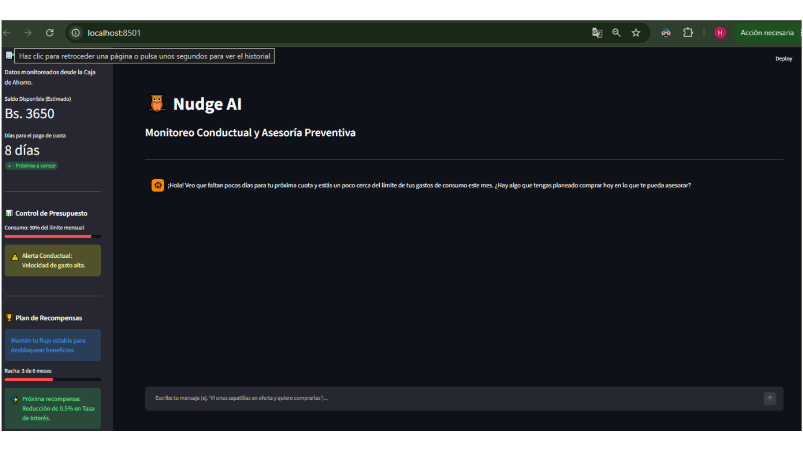

# Nudge AI - Prevención de Riesgo y Coach Conductual

> **Estado del Proyecto:** 🚀 Prototipo Funcional Avanzado (Monitoreo Preventivo)

Nudge AI es un agente de Inteligencia Artificial especializado en finanzas conductuales (*Behavioral Finance*) y gestión de riesgo crediticio. Diseñado para entidades financieras, este sistema evoluciona el modelo tradicional de evaluación crediticia al realizar un seguimiento continuo post-desembolso. 

Mediante la lectura de datos de la caja de ahorro del cliente, Nudge AI envía "nudges" (estímulos empáticos) de forma proactiva para evitar gastos impulsivos por estrés, prevenir la mora crediticia y fomentar la disciplina financiera a través de un sistema de recompensas gamificado (ej. reducción de tasas de interés).

## 🎯 Objetivos del Proyecto

* **Prevención de Mora Crediticia:** Monitorear la velocidad de gasto mensual para intervenir conductualmente antes de que el cliente se quede sin liquidez para su cuota.
* **Intervención Conductual:** Detectar momentos de fricción emocional y proporcionar estrategias de pausa reflexiva fundamentadas en la literatura científica.
* **Sistema de Recompensas (Contratos de Ulises):** Fomentar el buen comportamiento de pago mediante metas gamificadas y beneficios financieros tangibles.
* **Innovación FinTech:** Aplicar modelos de lenguaje de vanguardia en el análisis de riesgo y comportamiento dentro del ecosistema bancario boliviano y regional.

## 🛠️ Tecnologías y Arquitectura

Este proyecto está construido con una **Arquitectura Multi-Agente** con memoria aumentada y análisis de datos en tiempo real:

* **Interfaz y Dashboard:** Streamlit (Panel visual de perfil crediticio y chat interactivo).
* **Lenguaje:** Python 3.10+
* **Orquestación:** LangChain (Cadenas, Output Parsers y Enrutamiento Dinámico).
* **Motor de IA:** Google Gemini 3.5 Flash (Generación empática y triaje cognitivo).
* **Memoria RAG:** FAISS + HuggingFace (`all-MiniLM-L6-v2`) para la integración estricta de bibliografía conductual (Kahneman, Thaler).
* **Validación Estructural:** Pydantic (Garantía de formato JSON).
* **Seguridad:** `python-dotenv` para gestión de credenciales.

## Instrucciones para Ejecutar el Proyecto
Sigue estos pasos para clonar, configurar e iniciar el entorno localmente:

Paso 1: Configurar el Entorno Virtual
Crea y activa un entorno virtual de Python en la raíz de tu proyecto:

python -m venv venv
.\venv\Scripts\activate

Paso 2: Instalar Dependencias
Instala todas las librerías necesarias registradas en el archivo de requerimientos:

pip install -r requirements.txt

Paso 3: Configurar Variables de Entorno
Crea un archivo llamado .env en la raíz del proyecto y añade tu credencial de Google:

GEMINI_API_KEY=tu_api_key_aqui

Paso 4: Ingesta de Datos para la Memoria RAG
Asegúrate de colocar los archivos PDF de la literatura conductual en la carpeta ./data y ejecuta el script de indexación (este paso generará la carpeta local faiss_index/):

python memoria_rag.py

Paso 5: Lanzar la Aplicación Web
Inicia el servidor local de Streamlit para interactuar con la plataforma desde tu navegador:

streamlit run app.py

## Ejemplos de Preguntas que el Agente Puede Responder
El sistema procesa e interpreta consultas complejas que mezclan estrés psicológico, decisiones impulsivas o requerimientos operativos:

"Tuve una semana pésima en mi trabajo y me siento súper estresado. Estoy pensando seriamente en gastarme Bs. 3000 de mis ahorros en un viaje de fin de semana para desconectarme."

"Me ofrecieron una tarjeta de crédito en otra tienda y quiero sacarla para comprar ropa en oferta. ¿Qué opinas?"

"Necesito retirar efectivo de mi cuenta o programar una transferencia internacional para mañana por la mañana."

"Quiero saber cómo va mi progreso con el beneficio de la tasa de interés preferencial que me ofreció el banco."

## Ejemplos de Respuestas Generadas por el Agente
Caso: Intención de Gasto Emocional Cercano al Límite de Presupuesto
Entrada del Usuario:

"Me siento sumamente agotado y creo que me voy a gastar todos mis ahorros comprándome el último celular de gama alta para sentirme mejor de una vez."

Respuesta de Nudge AI:

"Te entiendo perfectamente; después de días intensos, es completamente natural que busques una recompensa inmediata para aliviar esa carga. Sin embargo, analizando tus datos de consumo, veo que ya has ejecutado el 90% de tu presupuesto mensual y faltan solo 8 días para la cuota de tu crédito (Bs. 1200).

Científicamente, cuando estamos bajo altos niveles de estrés, nuestro Sistema 1 (la mente intuitiva y emocional) toma el control y busca gratificación instantánea, nublando nuestra planificación a largo plazo. Comprar el celular te dará un pico de felicidad momentáneo, pero el estrés regresará con fuerza cuando venza tu cuota la próxima semana.

Además, ¡llevas una racha increíble de 3 meses de pago perfecto! Si mantienes tu balance estable por 3 meses más, asegurarás la reducción de tu tasa de interés en un 0.5%, lo que te ahorrará mucho dinero real en el futuro. ¿Qué te parece si aplicamos un nudge de pausa? Esperemos 48 horas antes de hacer clic en comprar. Si pasadas las dos semanas sigues sintiendo que lo necesitas con la misma urgencia, lo revisamos juntos bajo un plan estructurado. ¡Cuidemos ese progreso de nivel Plata que tanto te ha costado construir!"

## 🚀 Roadmap del Proyecto

- [x] Conexión segura con el motor LLM (Gemini).
- [x] Implementación de "Nudges" conductuales mediante System Prompts.
- [x] Agente de Triaje Cognitivo (Clasificador de intenciones).
- [x] Implementación de memoria RAG para lectura de bibliografía conductual.
- [x] Desarrollo de Interfaz de Usuario interactiva (Streamlit).
- [x] **NUEVO:** Integración de Dashboard de Evaluación Crediticia (Simulación de Caja de Ahorro).
- [x] **NUEVO:** Lógica de monitoreo preventivo de mora y sistema de recompensas.

---

---
*Desarrollado con un enfoque científico y tecnológico para la modernización financiera desde Bolivia.*